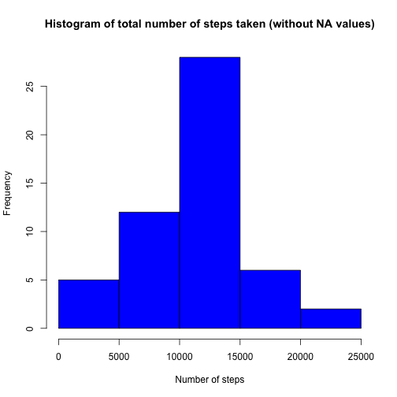
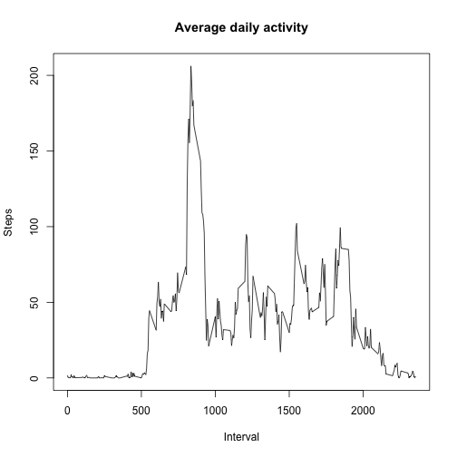
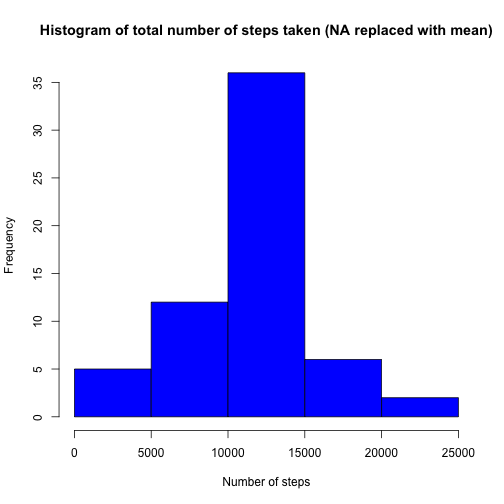
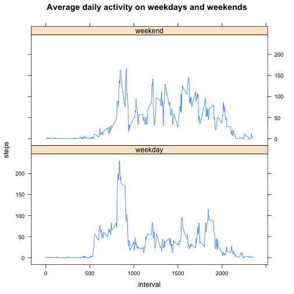

# Reproducible Research: Peer Assessment 1

## Loading and preprocessing the data

The raw data is contained in a .zip file. If we haven't done so already, we must first unzip it to get the .csv file.


```r
if ( ! file.exists('activity.csv')) {
  unzip('activity.zip')
}

stepsData <- read.csv('activity.csv')
```

The data has some missing values. We'll ignore it for now.

## What is mean total number of steps taken per day?

First, let's make a histogram of the total number of steps taken each day. We'll need a table with aggregate data for each day. We can do this using the "aggregate" function (note that the days that contain only missing values will be ignored in this data set):


```r
totalStepsByDay <- aggregate(steps ~ date, stepsData, sum)

hist(totalStepsByDay$steps, 
     xlab = 'Number of steps', 
     main = 'Histogram of total number of steps taken (without NA values)', 
     col = 'blue')
```



The mean and the median total number of steps are calculated as follows:


```r
meanStepsWithNA <- mean(totalStepsByDay$steps)
medianStepsWithNA <- median(totalStepsByDay$steps)
```

The mean is about 10766.19 and the median is 10765.

## What is the average daily activity pattern?

Let's take a look at the average activity during each day. We will need an aggregate data set that contains the daily average number of steps for each interval:


```r
averageStepsByInterval <- aggregate(steps ~ interval, stepsData, mean)
```

We can plot this data to understand it more clearly:


```r
plot(averageStepsByInterval$interval, 
     averageStepsByInterval$steps, 
     type = 'l', 
     xlab = 'Interval', 
     ylab = 'Steps', 
     main = 'Average daily activity')
```



There's a big spike in activity indicating that the person is highly active in the morning, around 8 o'clock. Let's find the exact 5-minute interval:


```r
maxActivityInterval <- averageStepsByInterval[
  averageStepsByInterval$steps == max(averageStepsByInterval$steps), 
  'interval']
```

Which shows that on average, the maximum number of steps each day is taken at approximately 8:35 in the morning.

## Imputing missing values

So far we have used the dataset ignoring the missing values. In this section we will try to replace these values with the mean value for the given interval. First, let's calculate the total number of cases with missing values:


```r
missingCasesTotal <- sum( ! complete.cases(stepsData))
```

There are a total of 2304 NA values in the original dataset. We shall replace every NA value with the mean value for that interval and construct a new dataset:


```r
stepsDataFull <- stepsData

for (i in 1:dim(stepsDataFull)[1]) {
  if (is.na(stepsDataFull[i, 'steps'])) {
    currentInterval <- stepsDataFull[i, 'interval']
    stepsDataFull[i, 'steps'] <- averageStepsByInterval[
      averageStepsByInterval$interval == currentInterval, 
      'steps']
  }
}
```

Let's use this dataset to plot histogram of the total number of steps taken each day and calculate the mean and median total number of steps taken per day. 


```r
totalStepsByDayFullData <- aggregate(steps ~ date, stepsDataFull, sum)

hist(totalStepsByDayFullData$steps, 
     xlab = 'Number of steps', 
     main = 'Histogram of total number of steps taken (NA replaced with mean)', 
     col = 'blue')
```



```r
meanStepsWithoutNA <- mean(totalStepsByDayFullData$steps)
medianStepsWithoutNA <- median(totalStepsByDayFullData$steps)
```

The mean and the median are now both around 10766.19, compared to the mean and median of 10766.19 and 10765 respectively when using the dataset with missing values.

## Are there differences in activity patterns between weekdays and weekends?

In order to see the differences, we should plot the average number of steps taken, averaged across all weekday days or weekend days. First we need to create a new factor variable in the dataset indicating whether a given date is a weekday or weekend day.


```r
## Turn off locale and set the output to English
Sys.setlocale(category = "LC_TIME", "C")
```

```
## [1] "C"
```

```r
## First of all, let's make a vector with the weekday names for each case
weekdays <- weekdays(as.Date(stepsDataFull$date), abbr = TRUE)

## Then we will transform it to a logical vector that indicates whether
## this day is a weekend day or not (the name of the day is "Sat" or "Sun")

weekend <- weekdays %in% c("Sat", "Sun")

## After that we will make it a factor with two levels and add it to the dataset

stepsDataFull$day.type <- factor(weekend, 
                                 levels = c(FALSE, TRUE), 
                                 labels = c('weekday', 'weekend')) 
```

Now we can make a panel plot using the lattice package.


```r
averageStepsByIntervalAndDayType <- aggregate(steps ~ interval + day.type, 
                                              stepsDataFull, 
                                              mean)

require(lattice)

xyplot(steps ~ interval | day.type, 
       averageStepsByIntervalAndDayType, 
       layout = c(1, 2), 
       type = 'l', 
       main = "Average daily activity on weekdays and weekends")
```




We can now see that there is a difference in the overall activity on weekends and weekdays - the person appears to be less active on weekends, with the maximum average value of 166.6 steps as compared to 230.4 steps on weekdays. 
